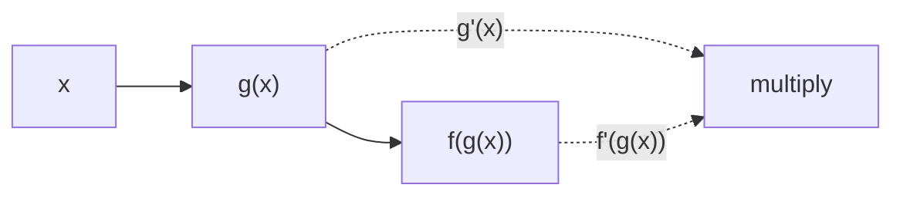

## The derivative as a limit

$$f'(x) = \lim_{h \to 0} \frac{f(x+h) - f(x)}{h}$$

Built directly on [[Limits and Continuity]] — differentiability implies continuity, never the reverse.

## Chain rule

> [!theorem]
> If $g$ is differentiable at $x$ and $f$ at $g(x)$, then
> $(f \circ g)'(x) = f'(g(x)) \cdot g'(x)$.

Mechanically: differentiate the outside, keep the inside, multiply by the inside's derivative.

> [!flashcard]
> Q: Chain rule for (f ∘ g)′(x)?
> A: f′(g(x)) · g′(x) — outside derivative at the inside, times inside derivative.

## Common derivatives

| $f(x)$ | $f'(x)$ |
|--------|---------|
| $x^n$ | $n x^{n-1}$ |
| $e^x$ | $e^x$ |
| $\ln x$ | $1/x$ |
| $\sin x$ | $\cos x$ |
